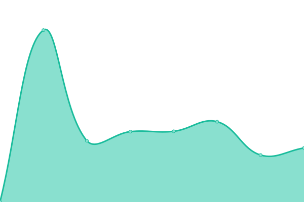

# [📈 Live Status](https://RDLGBC.github.io/upptime): <!--live status--> **🟧 Partial outage**

This repository contains the open-source uptime monitor and status page for [Michael Doyle | R&D LABS](rdlabs.science), powered by [Upptime](https://github.com/upptime/upptime).

With [Upptime](https://upptime.js.org), you can get your own unlimited and free uptime monitor and status page, powered entirely by a GitHub repository. We use [Issues](https://github.com/RDLGBC/upptime/issues) as incident reports, [Actions](https://github.com/RDLGBC/upptime/actions) as uptime monitors, and [Pages](https://RDLGBC.github.io/upptime) for the status page.

https://www.cloudns.net/blog/10-most-used-nslookup-commands/
nslookup -type=ns .
nslookup -type=ns com.

<!--start: status pages-->
<!-- This summary is generated by Upptime (https://github.com/upptime/upptime) -->
<!-- Do not edit this manually, your changes will be overwritten -->
<!-- prettier-ignore -->
| URL | Status | History | Response Time | Uptime |
| --- | ------ | ------- | ------------- | ------ |
|  [RDLABS](https://www.rdlabs.science/) | 🟥 Down | [rdlabs.yml](https://github.com/RDLGBC/upptime/commits/HEAD/history/rdlabs.yml) | 

 275ms
     
 | 

<a href="https://RDLGBC.github.io/upptime/history/rdlabs">0.00%</a>
    

|  [RDL](https://www.rdl.science/) | 🟥 Down | [rdl.yml](https://github.com/RDLGBC/upptime/commits/HEAD/history/rdl.yml) | 

 534ms
     
 | 

<a href="https://RDLGBC.github.io/upptime/history/rdl">0.00%</a>
    

|  [RespirVent](https://www.respirvent.com/) | 🟩 Up | [respir-vent.yml](https://github.com/RDLGBC/upptime/commits/HEAD/history/respir-vent.yml) | 

 846ms
     
 | 

<a href="https://RDLGBC.github.io/upptime/history/respir-vent">100.00%</a>
    

|  [Doyle Dynamics](http://www.doyledynamics.com/) | 🟩 Up | [doyle-dynamics.yml](https://github.com/RDLGBC/upptime/commits/HEAD/history/doyle-dynamics.yml) | 

 558ms
     
 | 

<a href="https://RDLGBC.github.io/upptime/history/doyle-dynamics">100.00%</a>
    

|  [R&D Lab Inc.](http://rdlabinc.com) | 🟥 Down | [r-and-d-lab-inc.yml](https://github.com/RDLGBC/upptime/commits/HEAD/history/r-and-d-lab-inc.yml) | 

 525ms
     
 | 

<a href="https://RDLGBC.github.io/upptime/history/r-and-d-lab-inc">0.00%</a>
    

|  [Public DNS Resolver - Cloudflare](https://1.1.1.1) | 🟩 Up | [public-dns-resolver-cloudflare.yml](https://github.com/RDLGBC/upptime/commits/HEAD/history/public-dns-resolver-cloudflare.yml) | 

 47ms
     
 | 

<a href="https://RDLGBC.github.io/upptime/history/public-dns-resolver-cloudflare">100.00%</a>
    

|  [Public DNS Resolver - Google](https://8.8.8.8) | 🟩 Up | [public-dns-resolver-google.yml](https://github.com/RDLGBC/upptime/commits/HEAD/history/public-dns-resolver-google.yml) | 

 223ms
     
 | 

<a href="https://RDLGBC.github.io/upptime/history/public-dns-resolver-google">100.00%</a>
    

|  [Cloudflare](https://www.cloudflare.com) | 🟩 Up | [cloudflare.yml](https://github.com/RDLGBC/upptime/commits/HEAD/history/cloudflare.yml) | 

 101ms
     
 | 

<a href="https://RDLGBC.github.io/upptime/history/cloudflare">100.00%</a>
    

|  [Cloudflare Pages](https://pages.cloudflare.com/) | 🟩 Up | [cloudflare-pages.yml](https://github.com/RDLGBC/upptime/commits/HEAD/history/cloudflare-pages.yml) | 

 118ms
     
 | 

<a href="https://RDLGBC.github.io/upptime/history/cloudflare-pages">100.00%</a>
    

|  [GitHub](https://github.com) | 🟩 Up | [git-hub.yml](https://github.com/RDLGBC/upptime/commits/HEAD/history/git-hub.yml) | 

 164ms
     
 | 

<a href="https://RDLGBC.github.io/upptime/history/git-hub">100.00%</a>
    

|  [Google](https://www.google.com) | 🟩 Up | [google.yml](https://github.com/RDLGBC/upptime/commits/HEAD/history/google.yml) | 

 79ms
     
 | 

<a href="https://RDLGBC.github.io/upptime/history/google">100.00%</a>
    

|  [Youtube](https://youtube.com) | 🟩 Up | [youtube.yml](https://github.com/RDLGBC/upptime/commits/HEAD/history/youtube.yml) | 

 393ms
     
 | 

<a href="https://RDLGBC.github.io/upptime/history/youtube">100.00%</a>
    

|  [Bing](https://www.bing.com) | 🟩 Up | [bing.yml](https://github.com/RDLGBC/upptime/commits/HEAD/history/bing.yml) | 

 75ms
     
 | 

<a href="https://RDLGBC.github.io/upptime/history/bing">100.00%</a>
    

|  [Facebook](https://www.facebook.com) | 🟩 Up | [facebook.yml](https://github.com/RDLGBC/upptime/commits/HEAD/history/facebook.yml) | 

 542ms
     
 | 

<a href="https://RDLGBC.github.io/upptime/history/facebook">100.00%</a>
    

|  [Wikipedia](https://en.wikipedia.org) | 🟩 Up | [wikipedia.yml](https://github.com/RDLGBC/upptime/commits/HEAD/history/wikipedia.yml) | 

 193ms
     
 | 

<a href="https://RDLGBC.github.io/upptime/history/wikipedia">100.00%</a>
    

<!--end: status pages-->

[**Visit our status website →**](https://RDLGBC.github.io/upptime)

## 📄 License

- Powered by: [Upptime](https://github.com/upptime/upptime)
- Code: [MIT](./LICENSE) © [Michael Doyle | R&D LABS](rdlabs.science)
- Data in the `./history` directory: [Open Database License](https://opendatacommons.org/licenses/odbl/1-0/)
