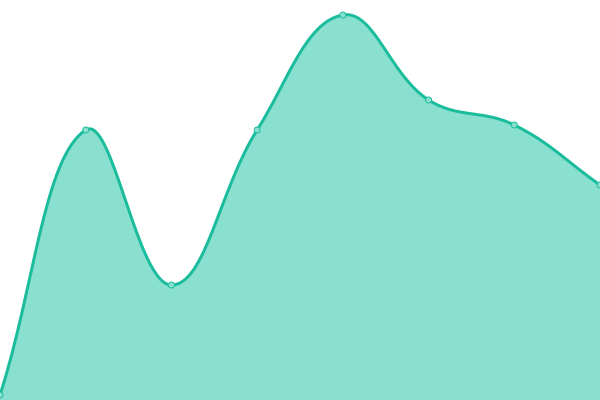
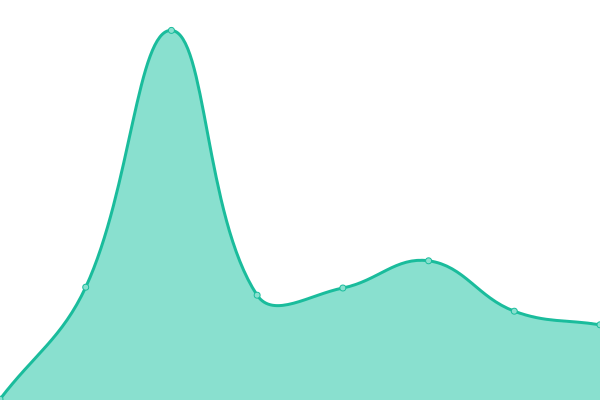
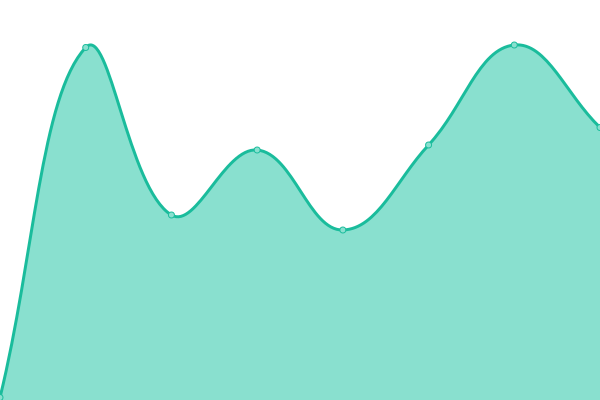
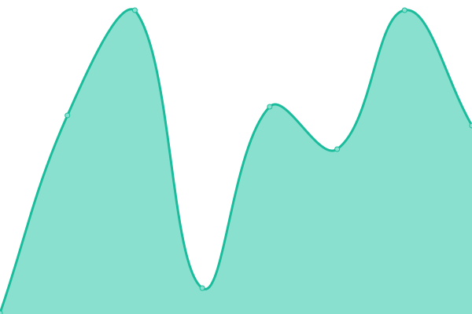

# [📈 Live Status](https://RDLGBC.github.io/upptime): <!--live status--> **🟧 Partial outage**

This repository contains the open-source uptime monitor and status page for [Michael Doyle | R&D LABS](rdlabs.science), powered by [Upptime](https://github.com/upptime/upptime).

With [Upptime](https://upptime.js.org), you can get your own unlimited and free uptime monitor and status page, powered entirely by a GitHub repository. We use [Issues](https://github.com/RDLGBC/upptime/issues) as incident reports, [Actions](https://github.com/RDLGBC/upptime/actions) as uptime monitors, and [Pages](https://RDLGBC.github.io/upptime) for the status page.

https://www.cloudns.net/blog/10-most-used-nslookup-commands/
nslookup -type=ns .
nslookup -type=ns com.

<!--start: status pages-->
<!-- This summary is generated by Upptime (https://github.com/upptime/upptime) -->
<!-- Do not edit this manually, your changes will be overwritten -->
<!-- prettier-ignore -->
| URL | Status | History | Response Time | Uptime |
| --- | ------ | ------- | ------------- | ------ |
|  [RDLABS](https://www.rdlabs.science/) | 🟥 Down | [rdlabs.yml](https://github.com/RDLGBC/upptime/commits/HEAD/history/rdlabs.yml) | 

 309ms
     
 | 

<a href="https://RDLGBC.github.io/upptime/history/rdlabs">0.00%</a>
    

|  [RDL](https://www.rdl.science/) | 🟥 Down | [rdl.yml](https://github.com/RDLGBC/upptime/commits/HEAD/history/rdl.yml) | 

 535ms
     
 | 

<a href="https://RDLGBC.github.io/upptime/history/rdl">0.00%</a>
    

|  [RespirVent](https://www.respirvent.com/) | 🟩 Up | [respir-vent.yml](https://github.com/RDLGBC/upptime/commits/HEAD/history/respir-vent.yml) | 

 837ms
     
 | 

<a href="https://RDLGBC.github.io/upptime/history/respir-vent">100.00%</a>
    

|  [Doyle Dynamics](http://www.doyledynamics.com/) | 🟩 Up | [doyle-dynamics.yml](https://github.com/RDLGBC/upptime/commits/HEAD/history/doyle-dynamics.yml) | 

 521ms
     
 | 

<a href="https://RDLGBC.github.io/upptime/history/doyle-dynamics">100.00%</a>
    

|  [R&D Lab Inc.](http://rdlabinc.com) | 🟥 Down | [r-and-d-lab-inc.yml](https://github.com/RDLGBC/upptime/commits/HEAD/history/r-and-d-lab-inc.yml) | 

 529ms
     
 | 

<a href="https://RDLGBC.github.io/upptime/history/r-and-d-lab-inc">0.00%</a>
    

|  [Authoritative DNS Provider - ?](https://) | 🟥 Down | [authoritative-dns-provider.yml](https://github.com/RDLGBC/upptime/commits/HEAD/history/authoritative-dns-provider.yml) | 

 0ms
     
 | 

<a href="https://RDLGBC.github.io/upptime/history/authoritative-dns-provider">0.00%</a>
    

|  [Public DNS Resolver - Cloudflare](https://1.1.1.1) | 🟩 Up | [public-dns-resolver-cloudflare.yml](https://github.com/RDLGBC/upptime/commits/HEAD/history/public-dns-resolver-cloudflare.yml) | 

 55ms
     
 | 

<a href="https://RDLGBC.github.io/upptime/history/public-dns-resolver-cloudflare">100.00%</a>
    

|  [Public DNS Resolver - Google](https://8.8.8.8) | 🟩 Up | [public-dns-resolver-google.yml](https://github.com/RDLGBC/upptime/commits/HEAD/history/public-dns-resolver-google.yml) | 

 334ms
     
 | 

<a href="https://RDLGBC.github.io/upptime/history/public-dns-resolver-google">100.00%</a>
    

|  [Cloudflare](https://www.cloudflare.com) | 🟩 Up | [cloudflare.yml](https://github.com/RDLGBC/upptime/commits/HEAD/history/cloudflare.yml) | 

 101ms
     
 | 

<a href="https://RDLGBC.github.io/upptime/history/cloudflare">100.00%</a>
    

|  [Cloudflare Pages](https://pages.cloudflare.com/) | 🟩 Up | [cloudflare-pages.yml](https://github.com/RDLGBC/upptime/commits/HEAD/history/cloudflare-pages.yml) | 

 113ms
     
 | 

<a href="https://RDLGBC.github.io/upptime/history/cloudflare-pages">100.00%</a>
    

|  [GitHub](https://github.com) | 🟩 Up | [git-hub.yml](https://github.com/RDLGBC/upptime/commits/HEAD/history/git-hub.yml) | 

 134ms
     
 | 

<a href="https://RDLGBC.github.io/upptime/history/git-hub">100.00%</a>
    

|  [Google](https://www.google.com) | 🟩 Up | [google.yml](https://github.com/RDLGBC/upptime/commits/HEAD/history/google.yml) | 

 77ms
     
 | 

<a href="https://RDLGBC.github.io/upptime/history/google">100.00%</a>
    

|  [Bing](https://www.bing.com) | 🟩 Up | [bing.yml](https://github.com/RDLGBC/upptime/commits/HEAD/history/bing.yml) | 

 72ms
     
 | 

<a href="https://RDLGBC.github.io/upptime/history/bing">100.00%</a>
    

|  [Facebook](https://www.facebook.com) | 🟩 Up | [facebook.yml](https://github.com/RDLGBC/upptime/commits/HEAD/history/facebook.yml) | 

 607ms
     
 | 

<a href="https://RDLGBC.github.io/upptime/history/facebook">100.00%</a>
    

|  [Wikipedia](https://en.wikipedia.org) | 🟩 Up | [wikipedia.yml](https://github.com/RDLGBC/upptime/commits/HEAD/history/wikipedia.yml) | 

 201ms
     
 | 

<a href="https://RDLGBC.github.io/upptime/history/wikipedia">100.00%</a>
    

|  [DNS TLD com - a.gtld-servers.net](http://192.5.6.30) | 🟥 Down | [dns-tld-com-a-gtld-servers-net.yml](https://github.com/RDLGBC/upptime/commits/HEAD/history/dns-tld-com-a-gtld-servers-net.yml) | 

 0ms
     
 | 

<a href="https://RDLGBC.github.io/upptime/history/dns-tld-com-a-gtld-servers-net">3.60%</a>
    

|  [DNS TLD com - b.gtld-servers.net](http://192.33.14.30) | 🟥 Down | [dns-tld-com-b-gtld-servers-net.yml](https://github.com/RDLGBC/upptime/commits/HEAD/history/dns-tld-com-b-gtld-servers-net.yml) | 

 0ms
     
 | 

<a href="https://RDLGBC.github.io/upptime/history/dns-tld-com-b-gtld-servers-net">3.81%</a>
    

|  [DNS TLD com - c.gtld-servers.net](http://192.26.92.30) | 🟥 Down | [dns-tld-com-c-gtld-servers-net.yml](https://github.com/RDLGBC/upptime/commits/HEAD/history/dns-tld-com-c-gtld-servers-net.yml) | 

 0ms
     
 | 

<a href="https://RDLGBC.github.io/upptime/history/dns-tld-com-c-gtld-servers-net">3.90%</a>
    

|  [DNS TLD com - d.gtld-servers.net](http://192.31.80.30) | 🟥 Down | [dns-tld-com-d-gtld-servers-net.yml](https://github.com/RDLGBC/upptime/commits/HEAD/history/dns-tld-com-d-gtld-servers-net.yml) | 

 0ms
     
 | 

<a href="https://RDLGBC.github.io/upptime/history/dns-tld-com-d-gtld-servers-net">4.14%</a>
    

|  [DNS TLD com - e.gtld-servers.net](http://192.12.94.30) | 🟥 Down | [dns-tld-com-e-gtld-servers-net.yml](https://github.com/RDLGBC/upptime/commits/HEAD/history/dns-tld-com-e-gtld-servers-net.yml) | 

 0ms
     
 | 

<a href="https://RDLGBC.github.io/upptime/history/dns-tld-com-e-gtld-servers-net">4.12%</a>
    

|  [DNS TLD com - f.gtld-servers.net](http://192.35.51.30) | 🟥 Down | [dns-tld-com-f-gtld-servers-net.yml](https://github.com/RDLGBC/upptime/commits/HEAD/history/dns-tld-com-f-gtld-servers-net.yml) | 

 0ms
     
 | 

<a href="https://RDLGBC.github.io/upptime/history/dns-tld-com-f-gtld-servers-net">4.52%</a>
    

|  [DNS TLD com - g.gtld-servers.net](http://192.42.93.30) | 🟥 Down | [dns-tld-com-g-gtld-servers-net.yml](https://github.com/RDLGBC/upptime/commits/HEAD/history/dns-tld-com-g-gtld-servers-net.yml) | 

 0ms
     
 | 

<a href="https://RDLGBC.github.io/upptime/history/dns-tld-com-g-gtld-servers-net">4.67%</a>
    

|  [DNS TLD com - h.gtld-servers.net](http://192.54.112.30) | 🟥 Down | [dns-tld-com-h-gtld-servers-net.yml](https://github.com/RDLGBC/upptime/commits/HEAD/history/dns-tld-com-h-gtld-servers-net.yml) | 

 0ms
     
 | 

<a href="https://RDLGBC.github.io/upptime/history/dns-tld-com-h-gtld-servers-net">4.84%</a>
    

|  [DNS TLD com - i.gtld-servers.net](http://192.43.172.30) | 🟥 Down | [dns-tld-com-i-gtld-servers-net.yml](https://github.com/RDLGBC/upptime/commits/HEAD/history/dns-tld-com-i-gtld-servers-net.yml) | 

 0ms
     
 | 

<a href="https://RDLGBC.github.io/upptime/history/dns-tld-com-i-gtld-servers-net">5.18%</a>
    

|  [DNS TLD com - j.gtld-servers.net](http://192.48.79.30) | 🟥 Down | [dns-tld-com-j-gtld-servers-net.yml](https://github.com/RDLGBC/upptime/commits/HEAD/history/dns-tld-com-j-gtld-servers-net.yml) | 

 0ms
     
 | 

<a href="https://RDLGBC.github.io/upptime/history/dns-tld-com-j-gtld-servers-net">5.57%</a>
    

|  [DNS TLD com - k.gtld-servers.net](http://192.52.178.30) | 🟥 Down | [dns-tld-com-k-gtld-servers-net.yml](https://github.com/RDLGBC/upptime/commits/HEAD/history/dns-tld-com-k-gtld-servers-net.yml) | 

 0ms
     
 | 

<a href="https://RDLGBC.github.io/upptime/history/dns-tld-com-k-gtld-servers-net">5.82%</a>
    

|  [DNS TLD com - l.gtld-servers.net](http://192.41.162.30) | 🟥 Down | [dns-tld-com-l-gtld-servers-net.yml](https://github.com/RDLGBC/upptime/commits/HEAD/history/dns-tld-com-l-gtld-servers-net.yml) | 

 0ms
     
 | 

<a href="https://RDLGBC.github.io/upptime/history/dns-tld-com-l-gtld-servers-net">6.30%</a>
    

|  [DNS TLD com - m.gtld-servers.net](http://192.55.83.30) | 🟥 Down | [dns-tld-com-m-gtld-servers-net.yml](https://github.com/RDLGBC/upptime/commits/HEAD/history/dns-tld-com-m-gtld-servers-net.yml) | 

 0ms
     
 | 

<a href="https://RDLGBC.github.io/upptime/history/dns-tld-com-m-gtld-servers-net">6.63%</a>
    

|  [DNS Root Server - A - Verisign Inc](http://198.41.0.4) | 🟥 Down | [dns-root-server-a-verisign-inc.yml](https://github.com/RDLGBC/upptime/commits/HEAD/history/dns-root-server-a-verisign-inc.yml) | 

 0ms
     
 | 

<a href="https://RDLGBC.github.io/upptime/history/dns-root-server-a-verisign-inc">7.25%</a>
    

|  [DNS Root Server - B](http://199.9.14.201) | 🟥 Down | [dns-root-server-b.yml](https://github.com/RDLGBC/upptime/commits/HEAD/history/dns-root-server-b.yml) | 

 0ms
     
 | 

<a href="https://RDLGBC.github.io/upptime/history/dns-root-server-b">7.70%</a>
    

|  [DNS Root Server - C](http://192.33.4.12) | 🟥 Down | [dns-root-server-c.yml](https://github.com/RDLGBC/upptime/commits/HEAD/history/dns-root-server-c.yml) | 

 0ms
     
 | 

<a href="https://RDLGBC.github.io/upptime/history/dns-root-server-c">8.52%</a>
    

|  [DNS Root Server - D](http://199.7.91.13) | 🟥 Down | [dns-root-server-d.yml](https://github.com/RDLGBC/upptime/commits/HEAD/history/dns-root-server-d.yml) | 

 0ms
     
 | 

<a href="https://RDLGBC.github.io/upptime/history/dns-root-server-d">8.90%</a>
    

|  [DNS Root Server - E](http://192.203.230.10) | 🟥 Down | [dns-root-server-e.yml](https://github.com/RDLGBC/upptime/commits/HEAD/history/dns-root-server-e.yml) | 

 0ms
     
 | 

<a href="https://RDLGBC.github.io/upptime/history/dns-root-server-e">10.32%</a>
    

|  [DNS Root Server - F](http://195.5.5.241) | 🟥 Down | [dns-root-server-f.yml](https://github.com/RDLGBC/upptime/commits/HEAD/history/dns-root-server-f.yml) | 

 0ms
     
 | 

<a href="https://RDLGBC.github.io/upptime/history/dns-root-server-f">11.38%</a>
    

|  [DNS Root Server - G](http://192.112.36.4) | 🟥 Down | [dns-root-server-g.yml](https://github.com/RDLGBC/upptime/commits/HEAD/history/dns-root-server-g.yml) | 

 0ms
     
 | 

<a href="https://RDLGBC.github.io/upptime/history/dns-root-server-g">12.74%</a>
    

|  [DNS Root Server - H](http://198.97.190.53) | 🟥 Down | [dns-root-server-h.yml](https://github.com/RDLGBC/upptime/commits/HEAD/history/dns-root-server-h.yml) | 

 0ms
     
 | 

<a href="https://RDLGBC.github.io/upptime/history/dns-root-server-h">14.94%</a>
    

|  [DNS Root Server - I](http://192.36.148.17) | 🟥 Down | [dns-root-server-i.yml](https://github.com/RDLGBC/upptime/commits/HEAD/history/dns-root-server-i.yml) | 

 0ms
     
 | 

<a href="https://RDLGBC.github.io/upptime/history/dns-root-server-i">0.15%</a>
    

|  [DNS Root Server - J](http://192.58.128.30) | 🟥 Down | [dns-root-server-j.yml](https://github.com/RDLGBC/upptime/commits/HEAD/history/dns-root-server-j.yml) | 

 0ms
     
 | 

<a href="https://RDLGBC.github.io/upptime/history/dns-root-server-j">17.33%</a>
    

|  [DNS Root Server - K](http://193.0.14.129) | 🟥 Down | [dns-root-server-k.yml](https://github.com/RDLGBC/upptime/commits/HEAD/history/dns-root-server-k.yml) | 

 0ms
     
 | 

<a href="https://RDLGBC.github.io/upptime/history/dns-root-server-k">0.00%</a>
    

|  [DNS Root Server - L](http://199.7.83.42) | 🟥 Down | [dns-root-server-l.yml](https://github.com/RDLGBC/upptime/commits/HEAD/history/dns-root-server-l.yml) | 

 0ms
     
 | 

<a href="https://RDLGBC.github.io/upptime/history/dns-root-server-l">0.00%</a>
    

|  [DNS Root Server - M](http://202.12.27.33) | 🟥 Down | [dns-root-server-m.yml](https://github.com/RDLGBC/upptime/commits/HEAD/history/dns-root-server-m.yml) | 

 0ms
     
 | 

<a href="https://RDLGBC.github.io/upptime/history/dns-root-server-m">39.20%</a>
    

<!--end: status pages-->

[**Visit our status website →**](https://RDLGBC.github.io/upptime)

## 📄 License

- Powered by: [Upptime](https://github.com/upptime/upptime)
- Code: [MIT](./LICENSE) © [Michael Doyle | R&D LABS](rdlabs.science)
- Data in the `./history` directory: [Open Database License](https://opendatacommons.org/licenses/odbl/1-0/)
